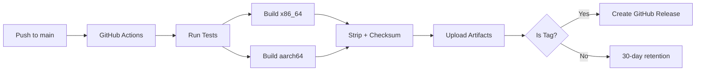

# FILE Relay Server - Deployment Guide

**Multi-architecture deployment system with automated builds**

---

## 🏗️ Build System

### Automated Multi-Arch Builds (GitHub Actions)

Every push to `main` or `develop` triggers automated builds for:
- **x86_64-unknown-linux-gnu** (Intel/AMD servers, most VPS providers)
- **aarch64-unknown-linux-gnu** (ARM64 servers, Hetzner Cloud ARM, Oracle ARM)

Artifacts are:
- **Stripped** (smaller binaries)
- **Checksummed** (SHA256 verification)
- **Released** automatically on git tags

### Workflow Triggers

```bash
# Manual trigger
gh workflow run build-relay.yml

# Push to main/develop (auto-trigger)
git push origin main

# Create release (builds + uploads artifacts)
git tag v0.1.0
git push origin v0.1.0
```

### Download Pre-Built Binaries

```bash
# Latest release
curl -fsSL https://github.com/kevinnadjarian/FILE/releases/latest/download/file-relay-linux-x86_64 -o file-relay
chmod +x file-relay

# Specific version
curl -fsSL https://github.com/kevinnadjarian/FILE/releases/download/v0.1.0/file-relay-linux-aarch64 -o file-relay
chmod +x file-relay

# Verify checksum
curl -fsSL https://github.com/kevinnadjarian/FILE/releases/latest/download/file-relay-linux-x86_64.sha256 | sha256sum -c
```

---

## 🚀 Deployment Methods

### 1. Proxmox LXC (Local Testing)

**Purpose**: Test locally before deploying to paid VPS

```bash
cd deploy/proxmox
./deploy-lxc.sh 199 file-relay-test
```

**What it does**:
1. Detects LXC architecture (x86_64 or aarch64)
2. Downloads matching pre-built binary from GitHub
3. Falls back to local cross-compiled build
4. Creates LXC container (Ubuntu 22.04, 2 vCPU, 2GB RAM)
5. Installs systemd service
6. Verifies health/challenge endpoints

**Configuration**:
- PVE Host: `100.123.83.107` (Tailscale IP)
- Storage: `rpool-ct` (ZFS pool for containers)
- Network: `vmbr2` bridge
- Template: `ubuntu-22.04-standard_22.04-1_amd64.tar.zst`

**Testing workflow**:
```bash
# Deploy
./deploy-lxc.sh 199

# Get LXC IP
LXC_IP=$(ssh root@100.123.83.107 "pct exec 199 -- hostname -I | awk '{print \$1}'")

# Test endpoints
curl http://$LXC_IP:8081/health
curl http://$LXC_IP:8081/challenge | jq
curl http://$LXC_IP:8081/metrics | grep file_relay

# Monitor logs
ssh root@100.123.83.107 pct exec 199 -- journalctl -u file-relay -f

# Destroy when done
ssh root@100.123.83.107 pct destroy 199
```

### 2. VPS Deployment (Production)

**Target**: Hetzner Strasbourg (FSN1), DigitalOcean, AWS, GCP, etc.

```bash
cd deploy/systemd
./deploy.sh relay-fsn1.hetzner.net
```

**What it does**:
1. Tests SSH connection
2. Detects VPS architecture
3. Downloads/uses matching binary
4. Creates `file-relay` system user
5. Installs binary to `/opt/file-relay/`
6. Installs systemd service with security hardening
7. Starts and enables service
8. Verifies endpoints

**Update existing deployment** (binary only):
```bash
./deploy.sh relay-fsn1.hetzner.net --update-only
```

**Verify deployment**:
```bash
./verify-deployment.sh relay-fsn1.hetzner.net
```

Runs 10 automated tests:
- SSH connectivity
- Service status
- Health/ready/metrics/challenge endpoints
- UDP port 8080 status
- Firewall configuration
- Resource usage (CPU/memory)
- Recent logs (error scanning)

---

## 🏗️ Manual Local Builds

### Prerequisites

```bash
# Install Rust
curl --proto '=https' --tlsv1.2 -sSf https://sh.rustup.rs | sh

# Add Linux targets
rustup target add x86_64-unknown-linux-gnu
rustup target add aarch64-unknown-linux-gnu
```

### Native Build (for macOS testing)

```bash
cargo build --release --package relay_server
# Binary: target/release/file-relay
```

### Cross-Compile for Linux

**Option A: Using Docker + cross** (recommended)

```bash
# Install cross
cargo install cross --git https://github.com/cross-rs/cross

# Build for x86_64 Linux
cross build --release --package relay_server --target x86_64-unknown-linux-gnu

# Build for ARM64 Linux
cross build --release --package relay_server --target aarch64-unknown-linux-gnu
```

**Option B: Without Docker** (requires GCC toolchain)

```bash
# macOS: Install cross-compiler
brew install FiloSottile/musl-cross/musl-cross

# Build
cargo build --release --package relay_server --target x86_64-unknown-linux-gnu
```

---

## 📦 Deployment Script Features

### Smart Binary Selection

Both `deploy-lxc.sh` and `deploy.sh` use the same logic:

1. **Detect target architecture** (`uname -m`)
2. **Try GitHub releases** (download pre-built binary)
3. **Fall back to local cross-compiled** (`target/<arch>-unknown-linux-gnu/release/`)
4. **Fall back to native** (`target/release/`) with warning

### GitHub Release Configuration

Edit at top of deploy scripts:

```bash
GITHUB_REPO="kevinnadjarian/FILE"
GITHUB_RELEASE="latest"  # or "v0.1.0" for specific version
```

### Architecture Support

| Architecture | `uname -m` | Binary Name |
|---|---|---|
| Intel/AMD 64-bit | `x86_64` | `file-relay-linux-x86_64` |
| ARM 64-bit | `aarch64`, `arm64` | `file-relay-linux-aarch64` |

---

## 🔒 Security Hardening (Systemd Service)

- **NoNewPrivileges=true** — prevents privilege escalation
- **PrivateTmp=true** — isolated /tmp
- **ProtectSystem=strict** — read-only /usr, /boot, /efi
- **ProtectHome=true** — no access to /home
- **User/Group isolation** — runs as `file-relay:file-relay`
- **Resource limits** — LimitNOFILE=65536, LimitNPROC=4096
- **Auto-restart** — Restart=always, RestartSec=10

---

## 🌍 Recommended VPS Providers

### Hetzner Cloud (Best for Europe)

| Location | Code | Latency from Nantes | Cost (CPX21) |
|---|---|---|---|
| **Strasbourg** | FSN1 | **5-10ms** | €10/mo |
| Frankfurt | FSN2 | 15-20ms | €10/mo |
| Helsinki | HEL1 | 40-50ms | €10/mo |

**Specs (CPX21)**: 4 vCPU, 4GB RAM, 80GB SSD, 20TB traffic

### DigitalOcean

| Location | Latency from Nantes |
|---|---|
| Frankfurt | 15-20ms |
| Amsterdam | 20-25ms |
| London | 20-30ms |

**Specs (Basic)**: $24/mo, 4GB RAM, 2 vCPU, 80GB SSD

### AWS EC2

| Region | Latency from Nantes |
|---|---|
| eu-west-3 (Paris) | **5-10ms** |
| eu-west-1 (Ireland) | 20-30ms |
| eu-central-1 (Frankfurt) | 15-20ms |

**Specs (t3.medium)**: ~$30/mo, 2 vCPU, 4GB RAM

---

## 📊 Performance Targets

### Expected Performance (2 vCPU, 2GB RAM)

- **Max peers**: 500-800
- **Packet rate**: 5k-8k packets/sec
- **CAPoW verification**: 100ms per proof
- **Memory**: ~200MB baseline + ~1KB per peer
- **Latency**: <20ms p95 (local network), <50ms p95 (global)

### Validation Criteria

- ✅ Health endpoints respond < 50ms
- ✅ Challenge rotates every 1 hour
- ✅ Service auto-restarts on crash
- ✅ No memory leaks over 24h
- ✅ CPU < 50% under normal load

---

## 🔄 CI/CD Workflow Summary



---

## 📝 Next Steps

1. **Test locally**: Deploy to Proxmox LXC, verify endpoints
2. **Deploy VPS**: Hetzner Strasbourg FSN1 (closest to Nantes)
3. **Beta test**: 7 days, 100 users, monitor metrics
4. **Multi-region**: Scale to 3 regions (US-East, EU-West, AP-Southeast)

---

**Status**: Ready for deployment  
**Last Updated**: 2026-05-18  
**Architecture**: Stateless, CAPoW anti-DoS, MPQUIC P2P relay
